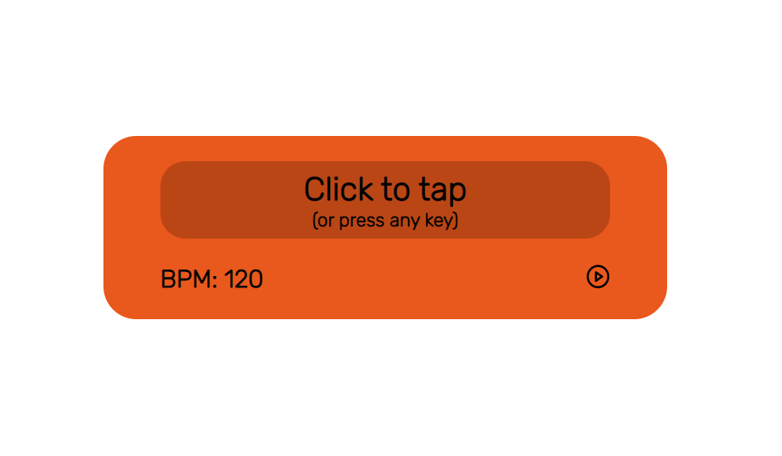

<!-- VARS -->
[live-demo-url]: https://chap0lin.github.io/bpm/
[all8-url]: https://www.all8.com/tools/bpm.htm
[bpmOnline-url]: http://www.beatsperminuteonline.com/
<!-- VARS -->
<h1 align="center">
    BPM - Beat Counter / Metronome
</h1>

    

## :memo: Descrição
Aplicação simples para identificar a batida de uma música e reproduzir em um metrônomo.

## :rocket: Como usar
Para testar a aplicação basta acessar o [link][live-demo-url]. 

## :gear: Processo
### :zap: Motivação:
Apaixonado por música decidi começar a produzir alguns beats e tentar recriar algumas músicas utilizando um DAW (Digital Audio Workstation). No DAW que eu utilizo não existe essa ferramenta e eu me encontrava constantemente utilizando ferramentas online ([Ex1][all8-url], [Ex2][bpmOnline-url]). Então decidi fazer uma minha.